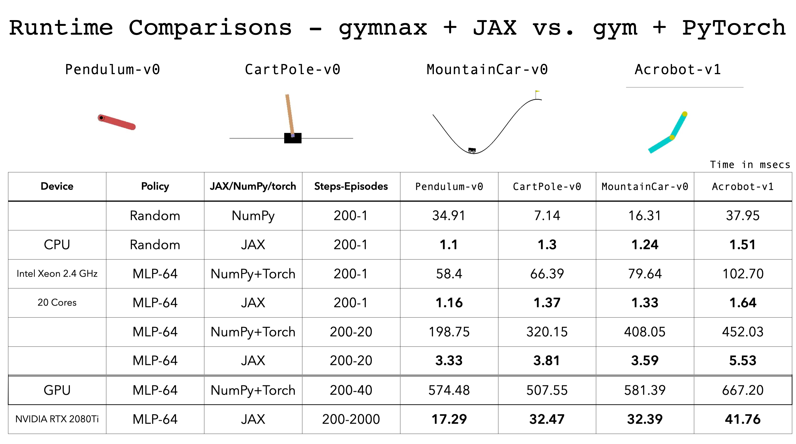

<p style="text-align:center;"></p>

<h1 align="center">
  <b>Classic Gym Environments in JAX 🏎️</b><br>
</h1>

<p align="center">
      <a href="https://pypi.python.org/pypi/gymnax">
        </a>
       <a href= "https://badge.fury.io/py/gymnax">
        </a>
       <a href= "https://github.com/RobertTLange/gymnax/blob/master/LICENSE.md">
        </a>
       <a href= "https://codecov.io/gh/RobertTLange/gymnax">
        </a>
       <a href= "https://colab.research.google.com/github/RobertTLange/gymnax/blob/main/examples/getting_started.ipynb">
        </a>
</p>


Are you fed up with slow CPU-based RL environment processes? Do you want to leverage massive vectorization for high-throughput RL experiments? `gymnax` brings the power of `jit` and `vmap`/`pmap` to the classic gym API. It support a range of different environments including [classic control](https://github.com/openai/gym/tree/master/gym/envs/classic_control) tasks, [bsuite](https://github.com/deepmind/bsuite), [MinAtar](https://github.com/kenjyoung/MinAtar/) and a collection of classic meta RL tasks. You can get started here 👉 [](https://colab.research.google.com/github/RobertTLange/gymnax/blob/main/examples/00_getting_started.ipynb). Finally, we provide trained checkpoints for PPO and ES in the [`gymnax-blines`](https://github.com/RobertTLange/gymnax-blines) repository.

## Basic `gymnax` API Usage 🍲

```python
import jax
import gymnax

rng = jax.random.PRNGKey(0)
rng, key_reset, key_policy, key_step = jax.random.split(rng, 4)

env, env_params = gymnax.make("Pendulum-v1")

obs, state = env.reset(key_reset, env_params)
action = env.action_space(env_params).sample(key_policy)
n_obs, n_state, reward, done, _ = env.step(key_step, state, action, env_params)
```

## Implemented Accelerated Environments 🌍


| Environment Name | Implemented | Tested | Speed Up (vs. NumPy) |
| --- | --- | --- | --- |
| `Pendulum-v0` | ✅  | ✅ |
| `CartPole-v1` | ✅  | ✅ |
| `MountainCar-v0` | ✅  | ✅ |
| `MountainCarContinuous-v0` | ✅  | ✅ |
| `Acrobot-v1` | ✅  | ✅ |
| --- | --- | --- | --- |
| `Catch-bsuite` | ✅  | ✅ |
| `DeepSea-bsuite` | ✅  | ✅ |
| `MemoryChain-bsuite` | ✅  | ✅ |
| `UmbrellaChain-bsuite` | ✅  | ✅ |
| `DiscountingChain-bsuite` | ✅  | ✅ |
| `MNISTBandit-bsuite` | ✅  | ✅ |
| `SimpleBandit-bsuite` | ✅  | ✅ |
| --- | --- | --- | --- |
| `Asterix-MinAtar` | ✅  | ❌ |
| `Breakout-MinAtar` | ✅  | ✅ |
| `Freeway-MinAtar` | ✅  | ❌ |
| `Seaquest-MinAtar` | ❌  | ❌ |
| `SpaceInvaders-MinAtar` | ✅  | ❌ |
| --- | --- | --- | --- |
| `BernoulliBandit-misc` | ✅  | ✅ |
| `GaussianBandit-misc` | ✅  | ✅ |
| `FourRooms-misc` | ✅  | ✅ |


## Installation ⏳

The latest `gymnax` release can directly be installed from PyPI:

```
pip install gymnax
```

If you want to get the most recent commit, please install directly from the repository:

```
pip install git+https://github.com/RobertTLange/gymnax.git@main
```

In order to use JAX on your accelerators, you can find more details in the [JAX documentation](https://github.com/google/jax#installation).

## Examples 📖
* 📓 [Environment API](notebooks/getting_started.ipynb) - Check out the API and accelerated control environments.
* 📓 [Anakin Agent](examples/getting_started.ipynb) - Check out the DeepMind's Anakin agent with `gymnax`'s `Catch-bsuite` environment.
* 📓 [CMA-ES](examples/pendulum_cma_es.ipynb) - CMA-ES in JAX with vectorized population evaluation.


## Key Selling Points 💵

- **Environment vectorization & acceleration**: Easy composition of JAX primitives (e.g. `jit`, `vmap`, `pmap`):

```python
# Jit-accelerated step transition
jit_step = jax.jit(env.step)

# vmap across random keys for batch rollouts
vreset_rng = jax.vmap(env.reset, in_axes=(0, None))
vstep_rng = jax.vmap(env.step, in_axes=(0, 0, 0, None))

# vmap across environment parameters (e.g. for meta-learning)
vreset_env = jax.vmap(env.reset, in_axes=(None, 0))
vstep_env = jax.vmap(env.step, in_axes=(None, 0, 0, 0))
```

- **Scan through entire episode rollouts**: You can also `lax.scan` through entire `reset`, `step` episode loops for fast compilation:

```python
def rollout(rng_input, policy_params, env_params, num_env_steps):
      """Rollout a jitted gymnax episode with lax.scan."""
      # Reset the environment
      rng_reset, rng_episode = jax.random.split(rng_input)
      obs, state = env.reset(rng_reset, env_params)

      def policy_step(state_input, tmp):
          """lax.scan compatible step transition in jax env."""
          obs, state, policy_params, rng = state_input
          rng, rng_step, rng_net = jax.random.split(rng, 3)
          action = network.apply(policy_params, obs)
          next_o, next_s, reward, done, _ = env.step(
              rng_step, state, action, env_params
          )
          carry = [next_o, next_s, policy_params, rng]
          return carry, [reward, done]

      # Scan over episode step loop
      _, scan_out = jax.lax.scan(
          policy_step,
          [obs, state, policy_params, rng_episode],
          [jnp.zeros((num_env_steps, 2))],
      )
      # Return masked sum of rewards accumulated by agent in episode
      rewards, dones = scan_out[0], scan_out[1]
      rewards = rewards.reshape(num_env_steps, 1)
      ep_mask = (jnp.cumsum(dones) < 1).reshape(num_env_steps, 1)
      return jnp.sum(rewards * ep_mask)
```

- **Super fast acceleration**: 



### Acknowledgements & Citing `gymnax` ✏️

If you use `gymnax` in your research, please cite it as follows:

```
@software{gymnax2021github,
  author = {Robert Tjarko Lange},
  title = {{gymnax}: A {JAX}-based Reinforcement Learning Environment Library},
  url = {http://github.com/RobertTLange/gymnax},
  version = {0.0.1},
  year = {2021},
}
```

We acknowledge financial support the [Google TRC](https://sites.research.google/trc/about/) and the Deutsche
Forschungsgemeinschaft (DFG, German Research Foundation) under Germany's Excellence Strategy - EXC 2002/1 "Science of Intelligence" - project number 390523135.

## Development 👷

You can run the test suite via `python -m pytest -vv --all`. If you find a bug or are missing your favourite feature, feel free to create an issue and/or start [contributing](CONTRIBUTING.md) 🤗.
